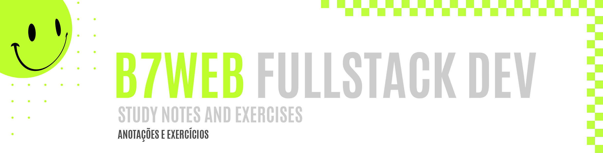
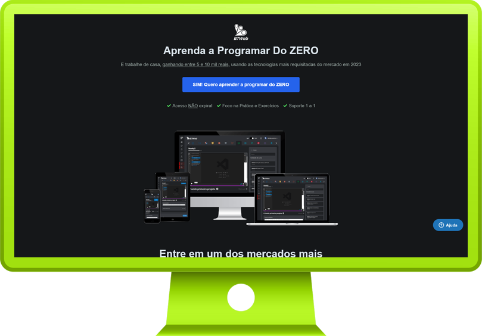
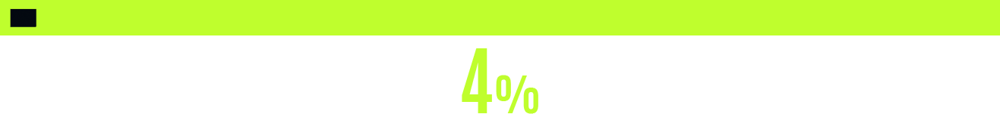

 
 

 
 

 

B7WEB Fullstack course is, by far, the longest course I've enrolled until now. It has around 800 hours of topics and practices, covering a very huge collection of technologies, getting deep into front-end, back-end and even mobile development. For this last one I am particullary interested, since I haven't touch any mobile development until now. It's a long way to go, but I can affirm that my excitment is also giant!

##### O curso Fullstack da empresa B7WEB é, até agora, o mais longo dos cursos em que eu já participei. Ele tem cerca de 800 horas de aulas, práticas e teóricas, cobrindo uma coleção gigante de tecnologias, adentrando o desenvolvimento front-end, back-end, e até mesmo mobile. Para este último, eu estou particularmente animada, já que eu não me envolvi com nenhum tipo de tecnologia mobile até agora. É uma jornada bem longa, porém minha animação é equivalente.

 
 
 
 

 

 
 
 
 

 

|  Topic       |  Content        |  Done        |
| ------------------ | ------------------ | :--------------------------------------------: |
|  HTML      | Basics, meta tags, inline style |  |
|  CSS      | Child selectors |  |
|  JavaScript      | Functions, data types, loops |  |
|  React.js      | Components |  |
|  More updates soon!      |   |

 
 
 
 
 

